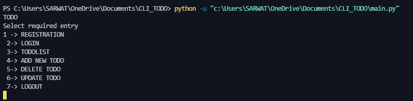
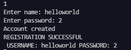
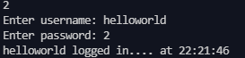
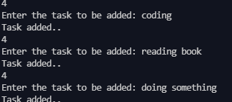
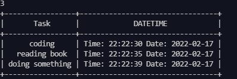
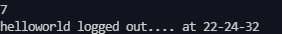

# CLI - TODO  

### A Command Line Interface TodoApplication with CRUD operations<hr>

#### This project is based on Object Oriented Programming , uses the 'prettytable' module to format the data  

### PREREQUISITE: prettytable<hr>

### start your project by downloading the prettytable module <br><hr>

```python
pip install prettytable
```  

<i>Some Screenshots of the project:</i><br>

#### main window


#### REGISTRATION  



#### LOGIN


#### ENTER NEW TASK


#### SHOW TODO LIST


#### LOGOUT EVENT

